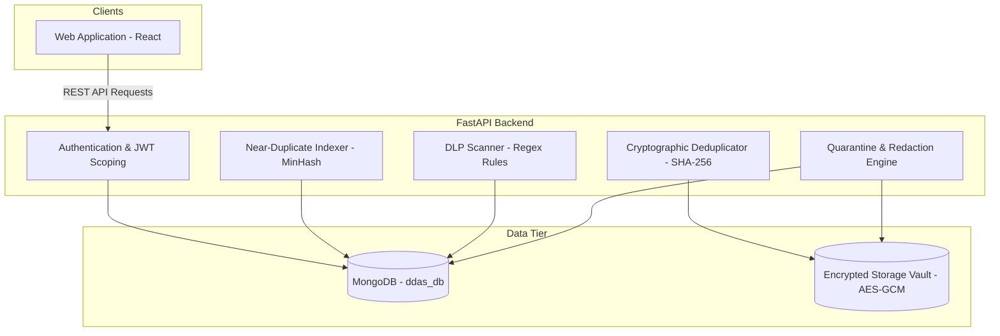

# DDAS — Data Download Duplication Alert System

DDAS is an enterprise-grade compliance, auditing, and storage optimization platform designed to regulate corporate file downloads and storage workflows. It features a secure multi-tenant architecture, cryptographic file deduplication, near-duplicate content fingerprinting, and real-time Data Loss Prevention (DLP) compliance alerting.

---

## 🏗️ System Architecture

DDAS leverages a centralized multi-tenant backend built with FastAPI, connected to a MongoDB document registry and an encrypted-at-rest storage vault. It services a modern, responsive React Web application.



---

## 🔒 Multi-Tenant Data Isolation

DDAS maintains strict logical and physical data boundaries to isolate multiple corporate tenants (companies) securely:

1. **Logical Isolation (Database Scoping):**
   Every resource (users, files, audit logs, and settings) is scoped with a `company` identifier. All read, write, and deletion database queries explicitly filter by the user's `company` tenant context.
   
2. **Safe Storage Deduplication:**
   Files are stored globally in the encrypted vault based on their SHA-256 hash. When multiple companies upload the same file, storage is optimized using deduplication. 
   - **No Data Loss on Delete:** If Company A deletes its reference to a deduplicated file, the system performs a global reference count across all tenants. The physical file is only purged when the global reference count reaches `0`.
   - **Isolated Redaction:** If Company A's administrator redacts sensitive content from a quarantined file, the system writes the redacted copy to a new path matching its new hash. Company B's reference and access to the original, unredacted file remain completely unaffected.

3. **Encryption-at-Rest:**
   Files are encrypted using AES-256-GCM prior to disk-level writes. Nonces and cryptographically derived master keys are fully isolated to secure the vault content.

---

## 🚀 Setup & Installation

### Prerequisites
- Python 3.8+
- Node.js 18+
- MongoDB (Running locally on `mongodb://localhost:27017` or configured via `.env`)

### 1. Central API Backend Setup
1. Navigate to the `backend/` directory:
   ```bash
   cd backend
   ```
2. Activate your virtual environment:
   - **Windows (PowerShell):**
     ```powershell
     .\venv\Scripts\Activate.ps1
     ```
   - **macOS/Linux:**
     ```bash
     source venv/bin/activate
     ```
3. Install dependencies:
   ```bash
   pip install -r requirements.txt
   ```
4. Configure the environment by copying the `.env.example` file to `.env` inside the `backend/` directory:
   ```bash
   cp .env.example .env
   ```
   *Edit the `.env` file to include your specific credentials.*

5. Initialize the database schema and seed the initial company collection:
   ```bash
   python seed_db.py
   ```
6. Start the development API server:
   ```bash
   uvicorn app:app --reload --host 127.0.0.1 --port 8000
   ```

### 2. Web Frontend Setup
1. Navigate to the `frontend/` directory:
   ```bash
   cd frontend
   ```
2. Install npm packages:
   ```bash
   npm install
   ```
3. Configure the environment by copying the `.env.example` file to `.env` inside the `frontend/` directory:
   ```bash
   cp .env.example .env
   ```
4. Run the local development server:
   ```bash
   npm run dev
   ```
5. Compile the web production build:
   ```bash
   npm run build
   ```

---

## 🧪 Validation & Automated Testing

DDAS includes validation tests to verify encryption integrity and multi-tenant data isolation:

### Run Cryptographic & AES Checks
Ensures that files are correctly encrypted at rest using AES-256-GCM and that keys are derived correctly:
```bash
python backend/test_security.py
```

### Run Multi-Tenancy Isolation Checks
Validates that file deduplication, safe reference count deletions, and isolated redaction behave correctly across logical company boundaries:
```bash
python backend/test_multitenancy.py
```
